### INDI USBRelay2 Roof

#### Summary
INDI USBRelay2 Roof is a Dome driver compatible with INDI Control Panel and INDI clients. (Tested only with EKOS in KStars)
The project has been compiled and tested on Linux (Ubuntu) x86_64, and Linux (Lubuntu) armv7l (ODROID C1+).
The "driver" uses the usb-relay-hid API to enable remote controlling of usbrelay2 devices, as roof controller and power switches. 

To open and close roof a pair of (2 channel) devices are used. One (Open) device connects to 12v roof motor (+,+) and (-,-), while the other (Close) device reverses the terminals (+,-) and (-,+). It is possible to calibrate the roof travel with motor speed, roof travel and travel limits, but it is advisable to have physical cut off switches in the fully opened and fully
closed position to avoid binding.

When power devices is added, you can power channels on and off in the Main Control tab. You also get a power tab that allows you to map the on and off states for all channels, when connecting, when parking, and when unparking the roof. The power switches in the Main tab will always be updated and reflect the actual state of the channel.

At the moment ONLY the two channel usbrelay2 device is supported. You can get it on [ebay](http://www.ebay.com/sch/i.html?_odkw=usbrelay+2&_osacat=0&_from=R40&_trksid=p2045573.m570.l1313.TR0.TRC0.H0.X2+channel+5v+usb+relay.TRS0&_nkw=2+channel+5v+usb+relay&_sacat=0) for a reasonable price. Note that it is the RED version that is supported and not the blue. For more info see [usb-relay-hid](https://github.com/pavel-a/usb-relay-hid), and the included links


INID USBRelay2 Roof does support simulation. You can compile it and see that it works on yous system before getting the devices. Just enable simulation in the Options tab before connecting.


<br>
#### Known issues
* At the moment the function 'USBInterface::GetDevices()' that calls the 'USBRL_API::usb_relay_device_enumerate()' never returns the info for more than two devices. This makes the device list in Device setup tab incomplete. It is at the moment necessary to connect atmost two devices simultaneously to note the device string for all devices. This is only a issue when setting up devices for the first time, as there is no issue connecting to 'unlisted' devices. (Make sure to save
  device list for future reference).
* If Open or Close is aborted using the 'Abort' button, the switch status will not reset. This means that if aborting 'Open/Close' the 'Open/Close' button must be klicked twice to resume 'Open/Close'. This does not happend when Parking or Unparking, nor if 'Open/Close' is aborted with a second klick on 'Open/Close'. Aborting Open and resuming to Close works as expexted, and vice versa

<br>
#### Attributions
* This project could not be done without the existing libindi project or the usb-relay-hid API.
* This project is 3rd party and dependent on the mentioned projects, and licensed accordingly. See LICENSE.
* Some files have additional lisence information, see file headers.

<br>
#### Installing dependencies
##### libindi and it's dependencies
* To install libindi or to build from source [see instructions](http://www.indilib.org/forum/general/210-howto-building-latest-libindi-ekos.html)

##### libusb_relay_device.so [usb_relay_hid], and it's dependencies
```
mkdir ~/Projects
cd ~/Projects
git clone https://github.com/pavel-a/usb-relay-hid.git
cd usb-relay-hid/commandline/makemake/
make
sudo cp usb_relay_device.so /usr/local/lib/libusb_relay_device.so
cd ../../lib/
sudo cp usb_relay_device.h /usr/local/include/usb_relay_device.h
echo "/usr/local/lib" | sudo tee /etc/ld.so.conf.d/usr_local_lib.conf
sudo ldconfig
```

<br>
#### Install INDI USBRelay2 Roof
```
cd ~/Projects
git clone https://github.com/magnue/indi_usbrelay2_roof.git
cd indi_usbrelay2_roof
mkdir build
cd build
cmake -DCMAKE_INSTALL_PREFIX=/usr . ..
sudo make install
```
#### Update
```
cd ~/Projects/indi_usbrelay2_roof/
git pull
cd build
sudo make install
```

<br>
#### Example of use

##### connect and calibrate roof
* Connect.. The driver will assume the roof is closed (parked) when connecting the first time.

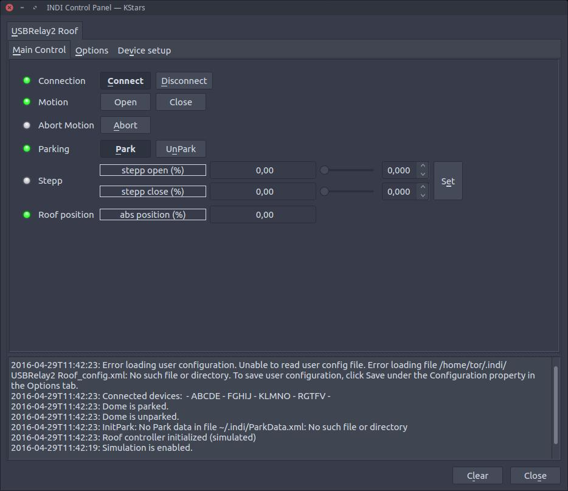

* Enter the open and close device. The device test will turn one device on for 1.5 sec and off again. This is the only way of knowing what device string belongs to a spesifik device. Take a note of it.
* Set the motor speed and roof travel. This wil calculate the total travel in milliseconds.
* For first run set the limits to 75, and 25. this will make the roof not fully open and close.

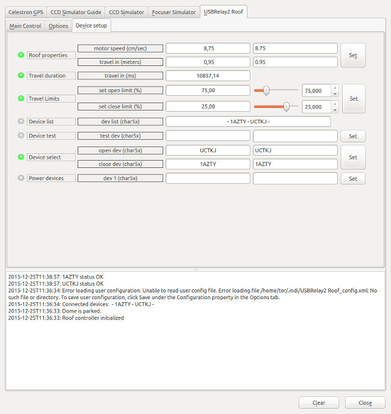

* Unpark the roof so it opens to 75%

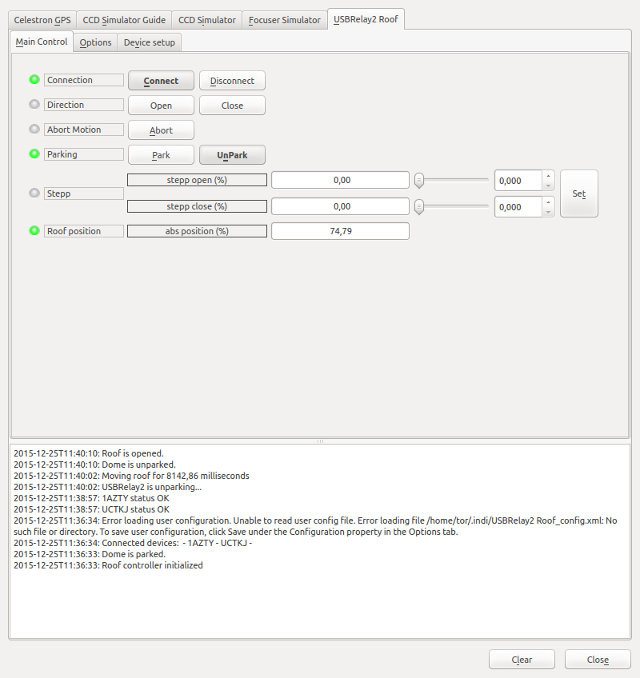

* Use the stepp open (%) to fully open the roof, and note the abs position (as this will be your open limit)


* Park the roof so it will close to 25%

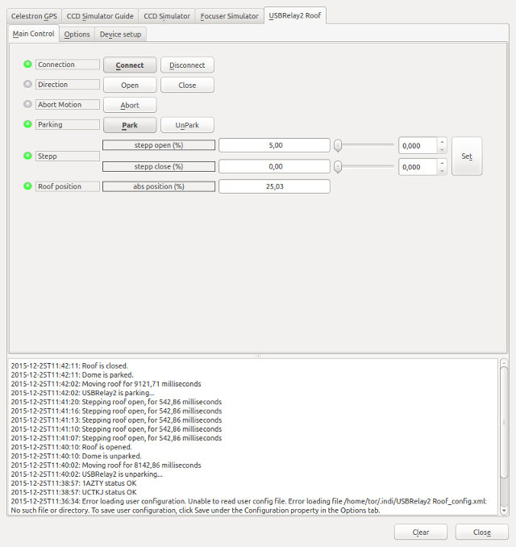

* Use stepp close to find the abs position for fully closed.

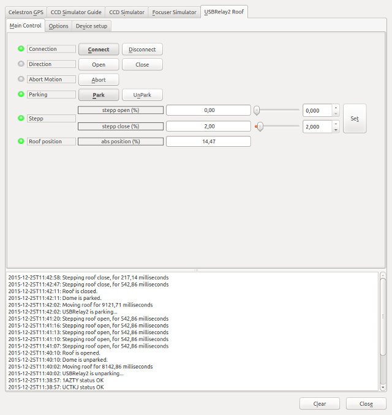

* Set your calibrated travel limits. 

##### connect and set power devices
* You can also add one or more (max 4) power devices. In this example i added one.
* Note tat there is now a Power Setup tab

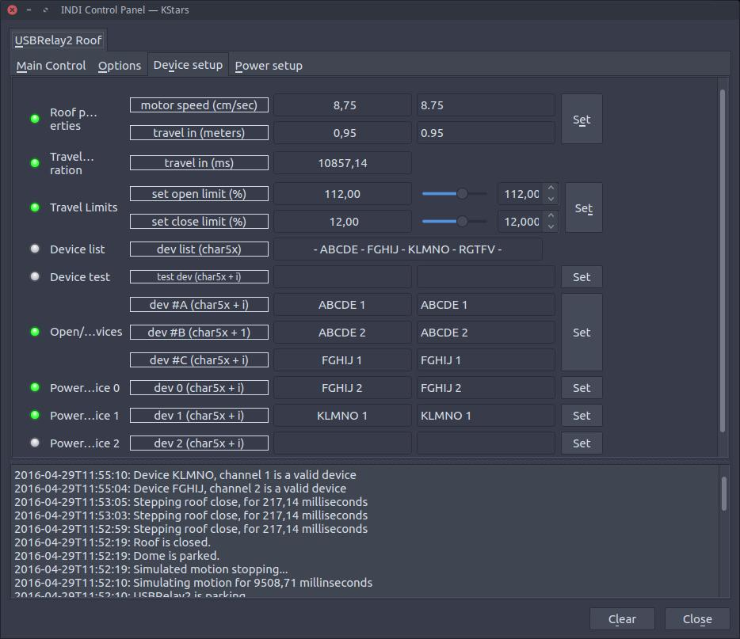

* The Power Setup tab. Default is leave everything as is.

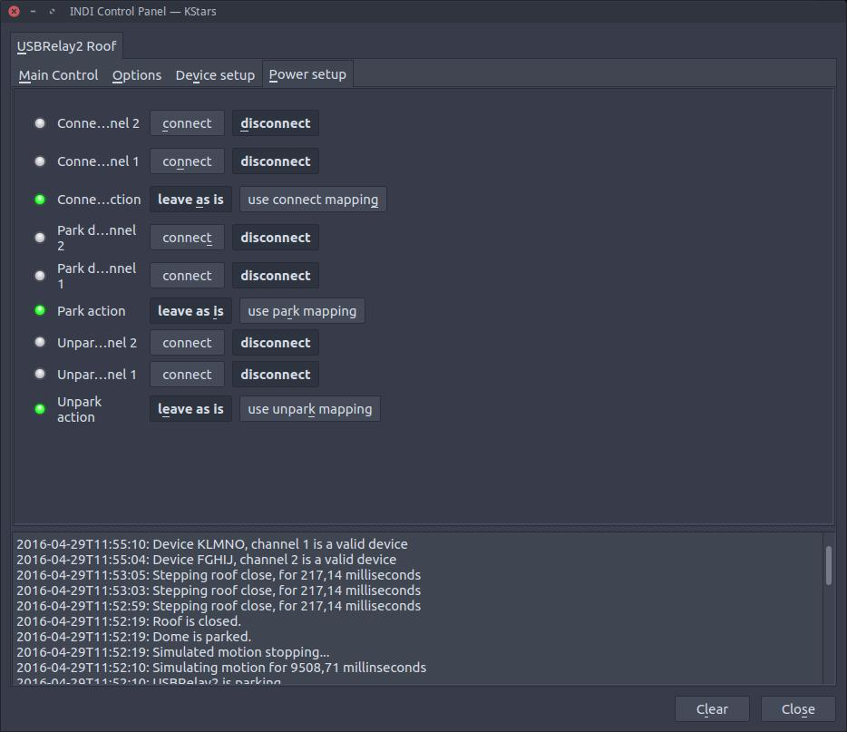

* In my case my mount supports hibernation and will be powered off when disconnected.
* In that case set the channel that powers on your mount, to power on when connecting.
* I have everything to power off when parking, and everything to power on when unparking.
* Depending on your needs all of this might need other settings.

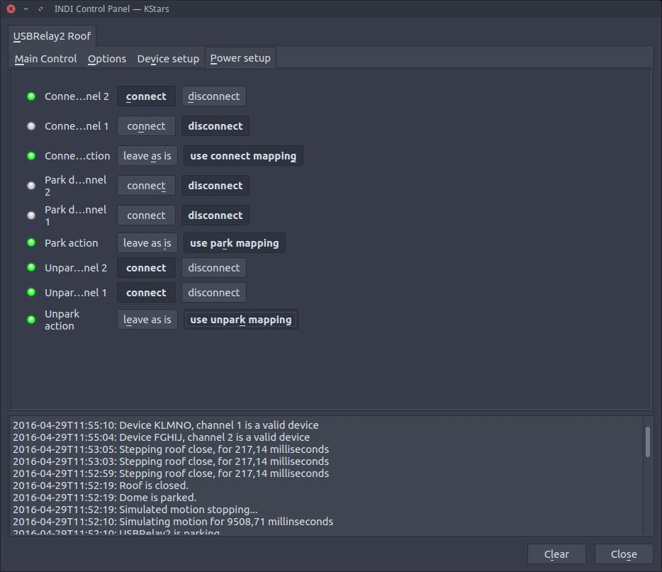

* As we added a power device we now have manual power switches on the Main Control tab.
* The status of these switches will always be updated when connecting, unparking and parking, and can be used for manual control.
* The difference between the (open, close) and the (park, unpark) switches is that (open, close) will not initiate the Power mapping.

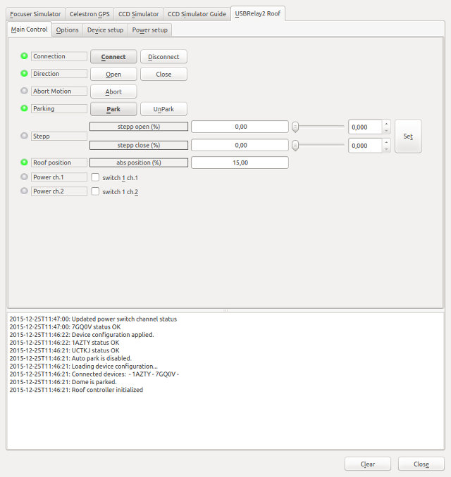

* Roof unparked and all channels on..

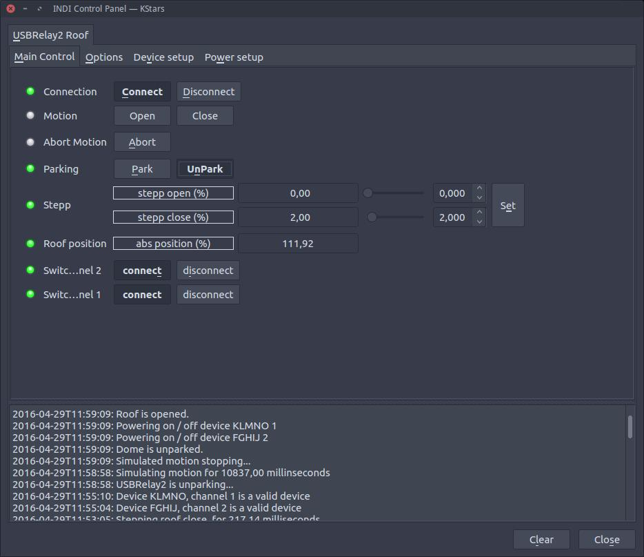

* Roof parked and all channels off..

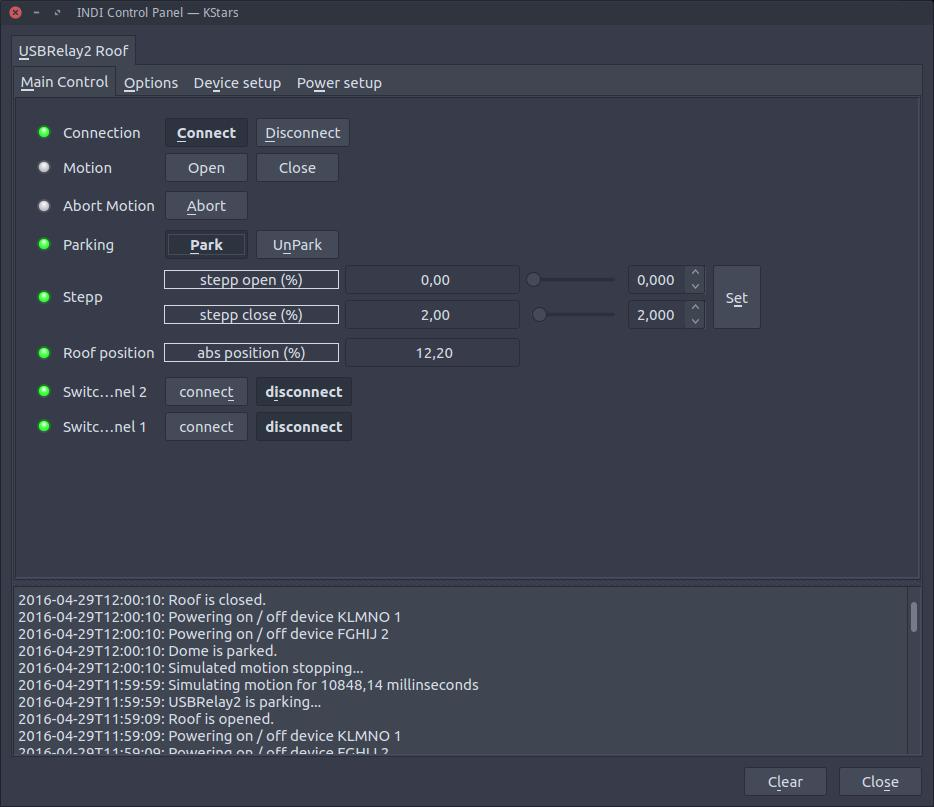

* Roof disconnected, reconnected and channel one is powered on..

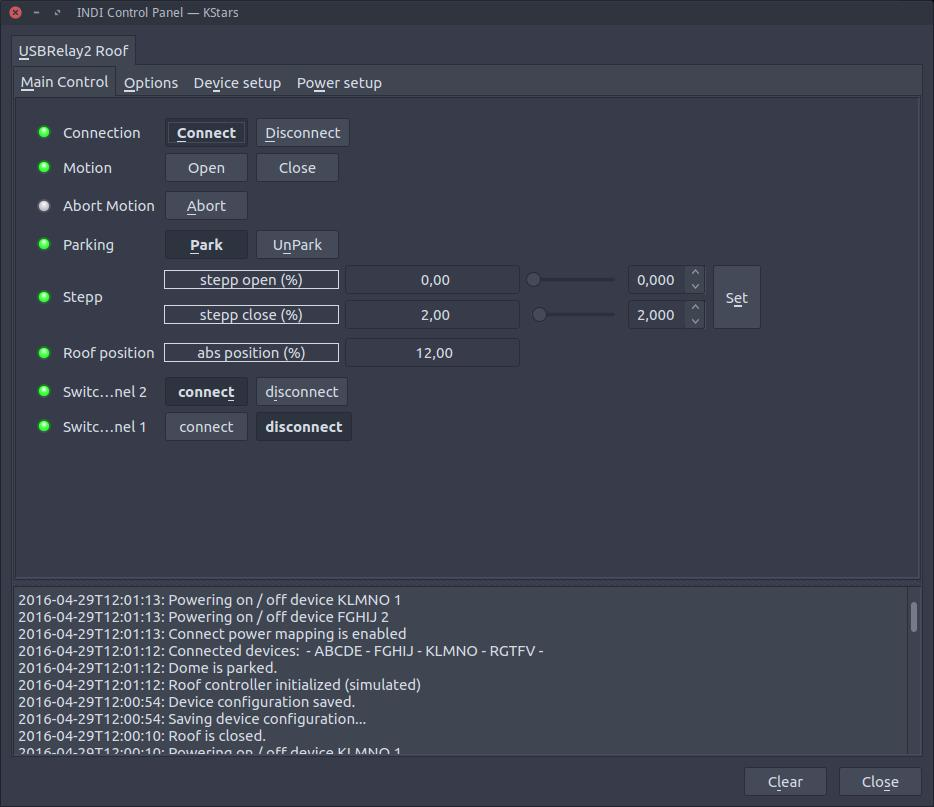

